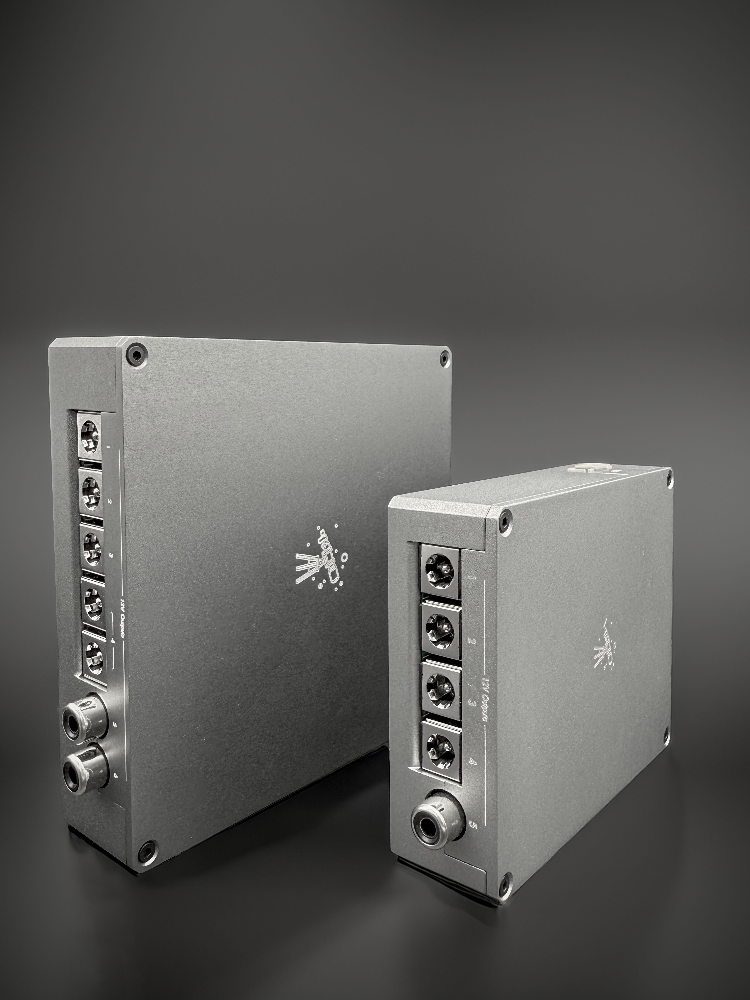
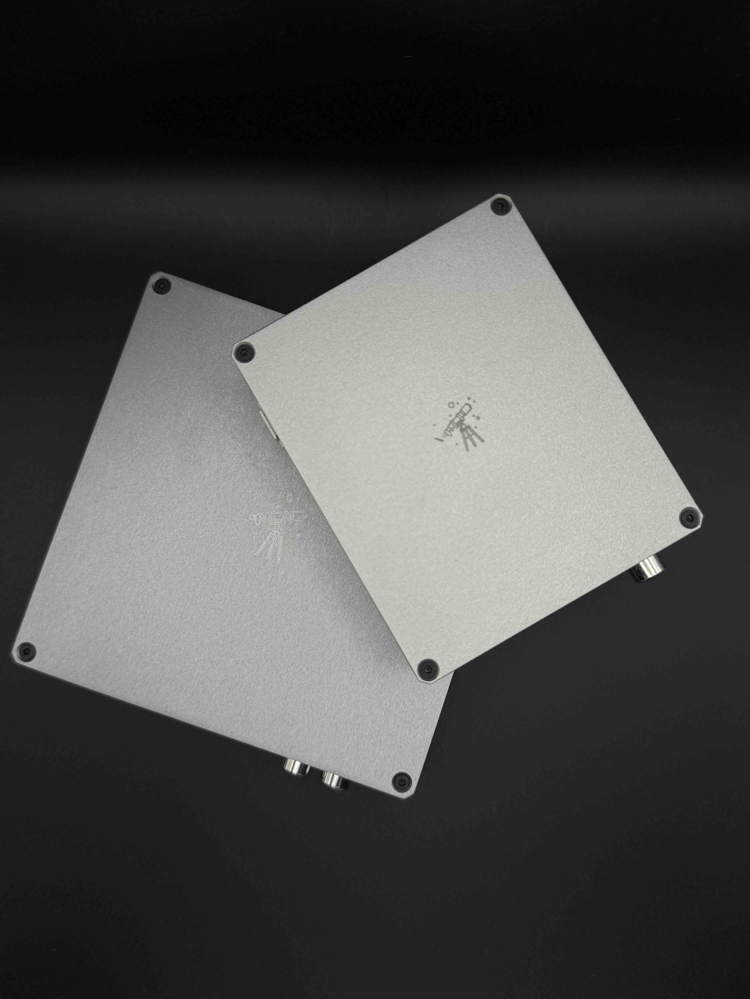

# PowerBox

If you’ve dabbled in astrophotography for more than five minutes, you’ve probably encountered The Great Cable Disaster™. Cables everywhere. Dangling. Tangling. Creating their own gravity wells.

Maybe you’ve had a meridian flip that turned into a full-blown rig flip (bonus points if something snapped in the process). Maybe a rogue cable decided to yoink your expensive camera’s USB connection straight to the afterlife. Or, if you’re extra lucky, a random neighborhood cat used your rig as a jungle gym, and all your night’s hard work turned into a gallery of not-so-artistic star trails.

Even when you think you’ve got cable management under control – spoiler alert – you don’t. Not for long, anyway.

So, like any good problem-solver (or desperate hobbyist on a budget), you go online. And what do you find? Power boxes! The magical fix! Only, oh wait… they cost a small fortune. Because of course they do.

That’s when I said, “Enough of this!” and decided to build my own. But not just any DIY power box – I wanted something better, smarter, and, most importantly, way cheaper.

And I did it. It’s beautiful. It’s powerful. It’s got more bells and whistles than a spaceship. Voltage readings? Check. Load monitoring? Check. Full control over each output? Oh yeah. The PowerBox isn’t just a power solution – it’s the power solution.

Read more on the build at: https://thebrightknight.github.io/

For detailed usage instructions visit - https://thebrightknight.github.io/powerbox/2025/02/18/post1.html

  
  

#### License Note:

This project is licensed under the MIT License, but with the following restrictions:

No Redistribution: You are not allowed to redistribute or share the code in any form.
No Modification: You may not modify, alter, or build upon the project.
Non-Commercial Use Only: The project is for personal, non-commercial use only. Commercial use, including selling or distributing for profit, is prohibited.
By using this project, you agree to abide by these restrictions. Thank you for respecting the license terms!
